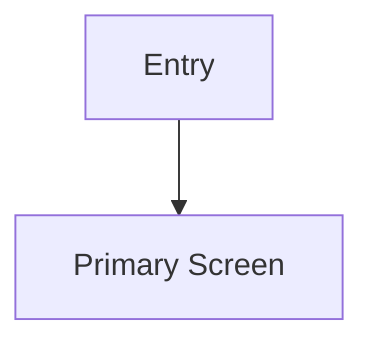

# PDR Template

Use this template for `inception/PDR.md`.

`PDR` means Product Design Requirements. It converts PRD behavior into screen, flow, interaction, and component requirements that Google AI Studio can implement.

~~~markdown
# Product Design Requirements

## 1. Design Summary

- **Product name**:
- **Platform target**:
- **Design objective**:
- **Canonical design contract**: `inception/DESIGN.md`
- **Related PRD**: `inception/PRD.md`

## 2. Experience Principles

List enforceable principles, not vague adjectives.

- `XP-001`:

## 3. Information Architecture

Describe navigation, app shell, route hierarchy, and primary content areas.

## 4. Screen Inventory

| Screen ID | Screen | Purpose | Primary user actions | States | Related PRD IDs |
| --- | --- | --- | --- | --- | --- |
| `SCR-001` |  |  |  | Empty, loading, error, success |  |

## 5. User Flows

| Flow ID | Flow | Steps | Edge cases | Related PRD IDs |
| --- | --- | --- | --- | --- |
| `FLOW-001` |  |  |  |  |

## 6. Component Requirements

Reference `DESIGN.md` component keys when possible. Add missing reusable components to `DESIGN.md` instead of inventing one-off styles.

| Component ID | Component | Purpose | Variants/States | Related screens | DESIGN.md key |
| --- | --- | --- | --- | --- | --- |
| `CMP-001` |  |  |  |  |  |

## 7. Interaction Requirements

Document input behavior, validation, AI generation controls, review flows, keyboard/touch behavior, transitions, and undo/retry expectations.

| ID | Interaction | Trigger | Expected behavior | Failure behavior |
| --- | --- | --- | --- | --- |
| `IX-001` |  |  |  |  |

## 8. AI UX Requirements

Describe how AI output appears, how users edit or approve it, how uncertainty is displayed, and what happens when generation fails.

| ID | Requirement | UI treatment | Related PRD IDs |
| --- | --- | --- | --- |
| `AIUX-001` |  |  |  |

## 9. Responsive and Platform Behavior

- **Web desktop**:
- **Web mobile**:
- **Android phone**:
- **Android tablet/foldable**:
- **Touch targets**:
- **Text overflow rules**:

## 10. Accessibility Requirements

Include contrast, focus states, semantic structure, keyboard navigation, screen reader labels, reduced motion, and tap target requirements.

## 11. Content and Microcopy

| Context | Copy requirement | Tone | Error/empty state copy |
| --- | --- | --- | --- |
|  |  |  |  |

## 12. AI Studio Implementation Notes

Summarize what Google AI Studio should build first, which screens are highest priority, which interactions must be functional, and which integrations can be stubbed.

## 13. Risks, Assumptions, and Open Questions

### Risks

- `R-001`:

### Assumptions

- `A-001`:

### Open Questions

- `OQ-001`:
~~~
